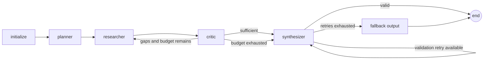

# Design: Guarded Multi-Agent Research Assistant

**Status:** Accepted for implementation  
**Decision date:** 2026-07-20

## Context

The system must turn an open-ended question into a cited answer while using unreliable external tools, bounded compute, and fallible language models. The primary design goal is not maximum autonomy. It is observable, bounded autonomy whose failure modes are explicit to callers.

## Decision

We will implement an explicit LangGraph state machine with typed shared state and named nodes:

Each role has one responsibility:

- **Planner** produces bounded, independently executable research tasks. It does not call tools.
- **Researcher** selects and invokes allow-listed tools for the next task, then records sanitized evidence.
- **Critic** checks coverage, citation integrity, and contradictions. It returns explicit gaps instead of rewriting the answer.
- **Synthesizer** produces the public response only from accepted evidence and maps claims to source identifiers.

Routing is deterministic Python. Models may propose plans, critiques, or answers, but they cannot choose arbitrary graph transitions or bypass budget checks. Schema and citation validation remain inside the Synthesizer boundary so malformed provider output never becomes typed graph state; its retry loop is bounded and independently tested.

## Thin vertical slice

Implementation starts with one web-search tool call followed by deterministic synthesis. This validates configuration, tool boundaries, schemas, telemetry, CLI behavior, and an end-to-end test before adding planning and critique loops. The full graph preserves the same interfaces so the slice is not throwaway code.

## Tool boundary

Every tool implements a typed `ResearchTool` protocol and returns a `ToolResult`. A single executor owns:

1. allow-list validation;
2. argument validation;
3. timeout and exception normalization;
4. output size limits and control-character removal;
5. URL/source normalization;
6. trace and budget accounting.

Raw tool output is never appended directly to model context. Python execution is a deliberately constrained subprocess: no imports, filesystem, network, attribute access, or unbounded loops; an AST allow-list and process timeout provide defense in depth. It is suitable for arithmetic and small data transformations, not hostile multi-tenant code.

## Guardrails and anticipated failures

| Failure mode | Defense | Degraded behavior |
|---|---|---|
| Infinite critic/research loop | Hard iteration count plus deterministic routing | Synthesize from evidence collected so far and set `budget_exceeded` |
| Tool-call or token blowout | Per-run counters checked before every model/tool operation | Refuse the next operation; preserve trace and return best effort |
| Tool misuse | Named allow-list, Pydantic arguments, AST policy for Python | Record typed tool error; critic may choose another route |
| Garbage/prompt injection in tool output | Size cap, control-character stripping, provenance wrapper, explicit untrusted-data prompt | Discard invalid records; never treat tool text as instructions |
| Hallucinated citation | Synthesizer receives canonical source IDs; post-validation rejects unknown IDs | Retry once, then deterministic evidence-based fallback |
| Malformed model JSON | Schema-first parsing with bounded repair retry | Deterministic fallback object with lower confidence |
| Search provider outage | Normalized errors; optional deterministic fixture provider for development | Continue with scratchpad/Python evidence or disclose evidence gap |
| Premature stop | Critic requires task coverage and minimum evidence count | Re-search named gaps while budget remains |
| Telemetry failure | Append-only JSONL writer fails open without changing run semantics | Trace remains in response; logging error is emitted to stderr |

## Key alternatives

**Opaque agent executor:** Rejected because hidden routing and retry behavior are hard to test and defend. Named graph nodes make every transition observable.

**Free-form ReAct loop:** Rejected as the primary topology. It is flexible but makes budget enforcement, role isolation, and repeatable failure analysis harder.

**Containerized Python sandbox:** Stronger isolation and the production recommendation. Not selected for the portable reference path because Docker is not always available in reviewers' environments. The constrained subprocess is clearly labeled as non-adversarial.

**Database-backed shared memory:** Deferred. Per-run typed state and an in-memory scratchpad avoid cross-run leakage. Durable research memory would need tenancy, retention, and deletion policies.

**Learned evaluator only:** Rejected. Evaluation combines deterministic fact/keyword checks with an optional LLM judge so CI remains reproducible and judge failures are visible.

## Operational contract

Each run emits total duration, tool latency, model and tool counts, estimated tokens and cost, terminal status, and budget state to structured JSONL. Traces exclude API keys and truncate tool payloads. CI never calls live APIs. Production deployment should replace the local JSONL sink with centralized telemetry and the Python subprocess with an isolated execution service.

## Implementation conformance note

The final implementation matches the role boundaries, deterministic routing, centralized tool validation, hard budgets, citation checks, degraded output, and telemetry described above. Two details were refined during implementation: validation is a bounded loop inside the Synthesizer rather than a separate graph node, and stateful tools receive an explicit per-run reset because the compiled graph is reused by the API. Both changes narrow the trust boundary without changing the external contract.

