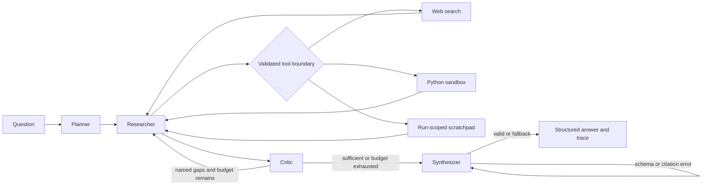

# Guarded Research Agent

A multi-agent research assistant that plans a bounded strategy, executes validated tools, critiques evidence coverage, and returns a schema-enforced cited answer. The reference implementation emphasizes explicit control flow, degraded-mode behavior, and operational visibility over unconstrained autonomy.

## Architecture



LangGraph owns the named nodes and edges; deterministic Python owns transitions and budget checks. Models may propose structured plans, critiques, and answers, but cannot invoke arbitrary tools or bypass limits. Every tool response crosses a shared validation, sanitization, provenance, timeout, and accounting boundary before entering graph state. See [DESIGN.md](DESIGN.md) for decisions and alternatives.

## What is implemented

- Planner, Researcher, Critic, and Synthesizer nodes with explicit conditional edges.
- Tavily or SerpAPI web search selected from environment configuration.
- AST-allow-listed, isolated Python subprocess for bounded calculations.
- In-memory scratchpad cleared before every graph run.
- Hard iteration, tool-call, token, and output-retry budgets.
- Pydantic response contract: `answer`, `confidence`, `sources`, `reasoning_summary`, and `budget_exceeded`.
- Unknown-citation rejection with one bounded repair attempt and an evidence-only fallback.
- JSONL run telemetry with total latency, tool latency, tool/model calls, estimated tokens, and configurable estimated cost.
- CLI `--trace`, FastAPI JSON endpoint, and a self-contained browser UI.
- A 16-question multi-hop eval set, deterministic fact checks, optional LLM judge, and non-exclusive failure buckets.

## Example trace

Question: “Find the launch years of Hubble and James Webb and identify which launched later.”

| Step | Node | Decision / output |
|---:|---|---|
| 1 | `initialize` | Accept and normalize the question. |
| 2 | `planner` | Create three bounded web-search tasks: Hubble year, Webb year, comparison. |
| 3 | `researcher` | Search the first task; accept sanitized evidence and canonical source IDs. |
| 4 | `researcher` | Search the second task; deduplicate source records. |
| 5 | `researcher` | Search the comparison task; record call latency and status. |
| 6 | `critic` | Confirm all task IDs have accepted evidence; no re-search edge is taken. |
| 7 | `synthesizer` | Produce the Pydantic response; reject any source ID absent from graph state. |

With `--trace`, the CLI returns these events alongside usage counters and the answer. Tool payloads are truncated and credentials never enter state or telemetry.

## Evaluation

Committed baseline from [eval/results.md](eval/results.md):

| Mode | Cases | Mean keyword/fact score | Citation-valid rate | LLM judge |
|---|---:|---:|---:|---:|
| Offline deterministic fixture | 16 | 1.000 | 1.000 | Not run |

The baseline validates multi-call graph traversal, fact scoring, and citation plumbing. It does not measure live search recall or model prose quality because each fixture returns its case’s labeled public facts and the offline model uses deterministic evidence synthesis. That is why the table does not imply “100% research accuracy.”

Failure buckets are `wrong_tool_choice`, `premature_stop`, `hallucinated_citation`, `budget_exceeded`, and `fact_check_failed`. The baseline observed none, while tests inject each important guardrail failure so detector behavior is not inferred from a perfect fixture run. The full root-cause and response analysis is in [docs/FAILURE_ANALYSIS.md](docs/FAILURE_ANALYSIS.md).

Live evaluation uses the configured search provider and OpenAI-compatible model for both the agent and LLM judge:

```bash
python -m agent.evaluation --mode live --output eval/results-live.md
```

Live evaluation incurs search requests plus agent and judge model calls for all 16 cases. Start with a low-cost model and inspect `eval/runs/` before broadening the set.

## Setup

Requires Python 3.11-3.13.

```bash
python -m venv .venv
# Windows
.venv\Scripts\activate
# macOS/Linux: source .venv/bin/activate
python -m pip install -e ".[dev,ui]"
cp .env.example .env
```

Configure one search key and, for model synthesis, an OpenAI-compatible key:

```dotenv
TAVILY_API_KEY=...
# or SERPAPI_API_KEY=...
OPENAI_API_KEY=...
OPENAI_BASE_URL=https://api.openai.com/v1
OPENAI_MODEL=gpt-4.1-mini
MODEL_COST_PER_MILLION_TOKENS=0
```

Without `OPENAI_API_KEY`, the system uses the deterministic heuristic planner/critic and evidence-only synthesis. Without a search key, web calls return a typed configuration error and the run degrades gracefully. Set `MODEL_COST_PER_MILLION_TOKENS` to the blended rate appropriate for the selected provider; the default `0` avoids publishing a stale pricing assumption. The estimate is a planning signal, not a billing record.

## Run

```bash
python -m agent.cli "Compare the launch years of Hubble and JWST" --trace
python -m agent.api
# Open http://127.0.0.1:8000
```

API example:

```bash
curl -X POST http://127.0.0.1:8000/api/research \
  -H "Content-Type: application/json" \
  -d '{"question":"Compare the launch years of Hubble and JWST"}'
```

Run the reproducible offline evaluation and quality gates:

```bash
python -m agent.evaluation --mode offline
ruff check .
ruff format --check .
black --check .
pytest --cov-fail-under=70
```

## Repository layout

```text
src/agent/          graph, roles, schemas, guardrails, tools, API and CLI
tests/              mocked unit and graph integration tests
eval/               labeled questions and committed baseline results
docs/               detailed failure analysis
ui/                 self-contained demo client
```

## Known limitations / more runway

- The Python subprocess blocks imports, calls, attributes, filesystem and network access, and has a timeout. It is not a hostile multi-tenant sandbox; production should use a locked-down container or remote execution service.
- Search snippets are evidence leads, not verified primary-source extracts. A production version should fetch allow-listed pages, retain quote spans, and distinguish primary from secondary sources.
- Token counts use a conservative character estimate and cost uses a caller-supplied blended rate. Provider usage metadata should replace both in production.
- The heuristic offline planner is intentionally simple and tends to choose web search where a learned planner might select Python after retrieval. Live eval traces should drive that tuning.
- JSONL is suitable for a reference deployment, not concurrent multi-instance analytics. Production should emit OpenTelemetry events and metrics to centralized storage.
- The in-memory graph has no durable checkpointing, tenancy, authentication, rate limiting, or distributed cancellation.
- The LLM judge can share biases with the answering model. A stronger release gate would use a separate judge family, adjudicated samples, and confidence intervals.

## License

MIT

